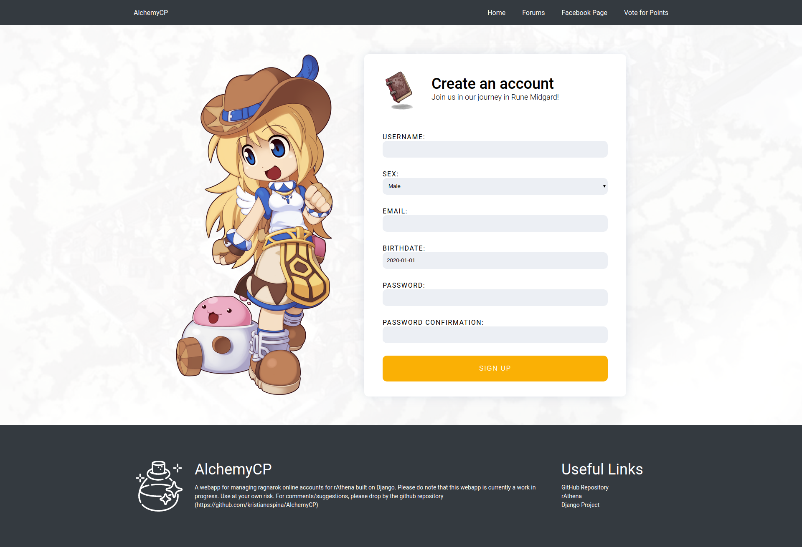

# 🍷 AlchemyCP

A webapp for managing ragnarok online accounts for rAthena built on Django

## 📸 Screenshots



## ⚙ Installation

### 1. Install required python libraries

```bash
pip install -r requirements.txt
```

### 2. Set-up Database Credentials

```python
# File: <root folder>/alchemyCP/settings.py
DATABASES = {
    'default': {
        'ENGINE': 'django.db.backends.mysql',
        'NAME': '<db_name>',
        'USER': '<username>',
        'PASSWORD': '<password>',
        'HOST': '127.0.0.1',
        'PORT': '3306',
    }
}
```

## 🧀 Usage

```bash
# Prepare Migrations
python manage.py makemigrations account
python manage.py migrate account

# Run the server 
python manage.py runserver
```

## ⚠ This is a work in progress!

Please use at your own risk!